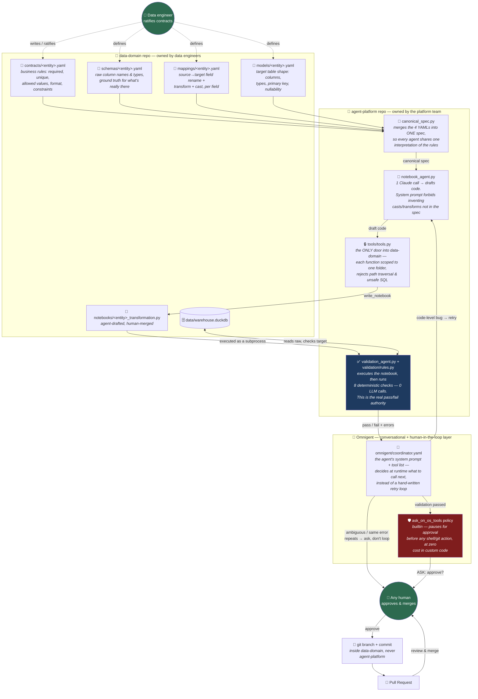

# agent-platform

An AI agent platform for data engineering: given a human-ratified data
contract, an agent drafts the DuckDB/Python code that transforms raw data
into the contract's shape, a deterministic rule engine checks its work with
zero LLM calls, and a human approves and merges the result. The agent never
edits a contract and never merges its own code — it only proposes, through a
narrow, permissioned tool layer, gated by [Omnigent](https://github.com/omnigent-ai/omnigent)'s
human-approval policy before anything git/PR-shaped happens.

**Setup, installation, and troubleshooting live in
[docs/RUNBOOK.md](docs/RUNBOOK.md)** — including WSL2/Ubuntu setup from
scratch, all prerequisites, a from-zero walkthrough for both repos, and a
table of every known issue with its fix. Once that's done, **[docs/TESTING.md](docs/TESTING.md)**
has the DuckDB CLI, how to query the warehouse, generating test data, and
5 scenarios (including adding a brand-new entity) to actually exercise the platform. This file is the
architecture overview; start in the runbook if you're setting up for the
first time.

---

## Architecture

Two teams own two different things, in two different repos, connected only
through a guarded tool layer — and Omnigent sits on top as the
conversational layer that decides what to do and pauses for a human before
anything risky.



**How to read it**: a human owns everything in the top-left box — that
never gets edited by the agent. Those four files merge into one shared
spec, which one narrow LLM call turns into draft code. A completely
separate, zero-LLM rule engine is the real judge of whether that code is
correct — not the agent's own opinion of its work. Omnigent's Coordinator
sits above all of it, deciding whether to retry, when to stop and ask a
human because something looks like a genuine contract gap rather than a
code bug, and — always, with no exception coded anywhere — pausing for
explicit human approval before touching git. A human reviews and merges
the PR; the agent never does either.

### Why it's split this way

| Design choice | Why |
|---|---|
| Two repos, not one | Each team ships independently. The agent has no filesystem access to `data-domain` except through `tools/tools.py` — verified against path-traversal and SQL-injection attempts in `tests/test_mcp_tools.py`. |
| One canonical spec, not four separate YAML parses | The notebook agent and the validator must agree on requirements byte-for-byte — merging once removes an entire class of "they each read the contract slightly differently" bugs. |
| Deterministic validation, zero LLM calls | The agent's own read of its code is never the authority. 8 rule functions either pass or don't — no ambiguity, no cost, no chance of the model rating its own work favorably. |
| Omnigent's Coordinator instead of a hand-written retry loop | Lets the agent reason about *why* something failed — a code bug worth retrying vs. a genuine contract gap worth asking a human about — rather than mechanically retrying every failure the same way. |
| `ask_on_os_tools`, a builtin policy, not custom code | The Coordinator's only shell usage is git/PR actions, so this one built-in policy gates exactly the risky step, for free. |

---

## Repo layout

```
agent-platform/
├── orchestrator/     canonical_spec.py, config.py
├── agents/            notebook_agent.py, validation_agent.py
├── validation/        rules.py (the 8 deterministic checks)
├── tools/              tools.py (the guarded tool layer)
├── omnigent/           coordinator.yaml (agent + policy config)
├── tests/              test_mcp_tools.py
└── docs/
    ├── RUNBOOK.md      ← full setup, install, and troubleshooting guide
    └── TESTING.md      ← DuckDB CLI, test data, and test scenarios
```
