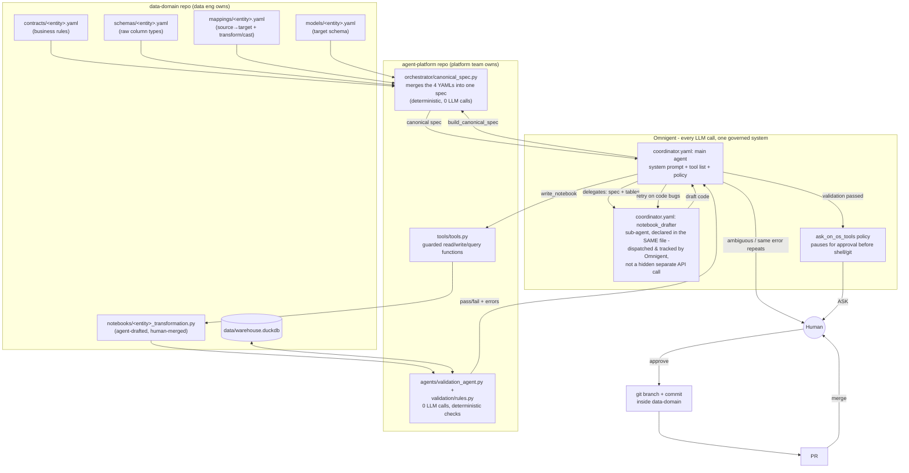

# Data Engineering Agent Platform — Architecture & Runbook

This document is for anyone new to this project: what it is, how the pieces
fit together, how to install and run everything from zero, and what to do
when something breaks. It assumes no prior context.

For how Omnigent itself works (the tool-calling loop, config file
structure, production conventions), see [OMNIGENT.md](OMNIGENT.md) — this
document is about *this project's* setup, that one is about Omnigent as a
technology.

---

## 1. What this is, in one paragraph

Two people own two different things. **Data engineers** own data contracts —
what a table means, what "valid" looks like — in the `data-domain` repo. A
**platform team** owns an AI agent that reads those contracts and drafts the
Python/DuckDB code that transforms raw data into that shape, in the
`agent-platform` repo. The agent never edits a contract and never merges its
own code — it proposes, a deterministic rule engine checks its work, and a
human approves and merges. Omnigent is the layer that turns "run a Python
script" into "have a conversation with an agent that decides what to do
next and pauses for your approval before anything risky."

---

## 2. Setting up WSL2 + Ubuntu on Windows (skip this if you already have it)

Everything else in this document requires a working WSL2 + Ubuntu
environment first (§6 explains what that is and why it's needed). If you
already have a WSL/Ubuntu terminal open and working — like the one this
whole runbook was written and tested from — **skip straight to §3**.

**Not hands-on verified by this project** — my own tool access runs
*inside* an already-existing WSL environment, so I have no way to actually
drive the Windows side (admin PowerShell, the Microsoft Store) myself.
These steps are Microsoft's own documented install process, not something
I ran and confirmed personally, unlike the rest of this document.

1. **Check if you already have it.** Open PowerShell and run:
   ```powershell
   wsl --list --verbose
   ```
   If this lists a distro with `VERSION` showing `2`, you already have
   WSL2 — check whether it's Ubuntu; if so, skip to §3. If it shows
   `VERSION 1`, see step 4 below.

2. **Install WSL2 + Ubuntu.** Open PowerShell **as Administrator** and run:
   ```powershell
   wsl --install -d Ubuntu
   ```
   This turns on the required Windows features, downloads Ubuntu, and
   installs WSL2 as the default version, all in one command, on a
   reasonably recent Windows 10/11. Restart when it asks you to.

3. **First launch.** After the restart, Ubuntu should open itself and
   finish installing; if not, launch "Ubuntu" from the Start menu. The
   first launch asks you to create a Linux username and password — this
   is separate from your Windows login, and is what you'll use for `sudo`
   going forward. This drops you into the same kind of terminal every
   command in this runbook assumes.

4. **If `wsl --list --verbose` showed `VERSION 1`** for an existing
   distro, upgrade it in place rather than reinstalling:
   ```powershell
   wsl --set-version Ubuntu 2
   ```
   WSL1 doesn't have the `localhost` port-forwarding behavior this runbook
   relies on (see the README's "Where it runs" note) — WSL2 specifically is required.

5. **Confirm it worked**, from inside the Ubuntu terminal:
   ```bash
   lsb_release -a      # should say Ubuntu
   uname -r             # should mention "WSL2" or "microsoft-standard-WSL2"
   ```

From here on, every command in this document runs inside that Ubuntu
terminal, not in PowerShell or cmd.

---

## 3. Why two repos, not one

| | `data-domain` | `agent-platform` |
|---|---|---|
| Owned by | Data engineers | Platform team |
| Contains | Contracts, schemas, mappings, target models, the generated notebooks, seed/test data | The agent's code: spec builder, notebook-generating agent, deterministic validator, tool layer, Omnigent config |
| Changes how | Humans edit contracts directly; notebooks arrive via agent-opened PRs | Independent deploys; never touches `data-domain` except through a narrow, guarded tool layer |

The split exists so the two teams can change their own thing without
coordinating a joint deploy, and so the agent physically **cannot** reach
outside `data-domain`'s four spec folders — every read/write goes through
`agent-platform/tools/tools.py`, which rejects any path that would escape
its allowed subdirectory (verified by `tests/test_mcp_tools.py`, including
explicit path-traversal and SQL-injection attempts).

---

## 4. Architecture diagram



**Reading it left to right**: contracts feed a spec builder (a deterministic
tool call, `build_canonical_spec` — zero LLM involved). The Coordinator
delegates drafting to `notebook_drafter`, a sub-agent declared in the same
`coordinator.yaml` file — a real Omnigent-dispatched LLM call, tracked and
governed the same way the Coordinator's own turns are, not a separate API
call hidden inside a Python tool. A completely separate zero-LLM rule
engine is the real judge of whether the drafted code is correct. The
Coordinator sits above all of it, deciding when to retry, when to stop and
ask a human because something looks like a genuine contract gap (not a
code bug), and — always — pausing for your explicit approval before
touching git.

---

## 5. What each piece does, and why it exists

| Component | What it does | Why |
|---|---|---|
| `contracts/<entity>.yaml` | Business rules: required, unique, allowed values, format, constraints | The one thing a human fully owns and ratifies |
| `schemas/<entity>.yaml` | Raw column names/types as they actually exist in the source | Ground truth for what's really in the raw table |
| `mappings/<entity>.yaml` | Field-by-field source→target rename + transform + cast | Tells the agent exactly what transformation is allowed — it must not invent its own |
| `models/<entity>.yaml` | Target table shape: columns, types, primary key, nullability | What "done" looks like |
| `orchestrator/canonical_spec.py` | Merges all four YAMLs into one `CanonicalSpecification` object, exposed as the `build_canonical_spec` tool | So the notebook drafter and the validator share one interpretation, instead of each re-parsing four files independently and possibly disagreeing. Deterministic, zero LLM calls. |
| `omnigent/coordinator.yaml`'s `notebook_drafter` sub-agent | A declared Omnigent sub-agent (`type: agent`) — given the canonical spec, writes the DuckDB transformation script | The only place an LLM judgment call belongs in code generation — deliberately narrow (its own prompt forbids inventing casts/transforms not in the spec), and dispatched *through* Omnigent, not via a separate hidden API call a Python tool makes on its own |
| `validation/rules.py` | 8 deterministic checks (columns exist, types match, required/unique/allowed-values/format/constraint) | Zero LLM calls — this is the actual authority on pass/fail, not the agent's own opinion of its code |
| `agents/validation_agent.py` | Runs the notebook as a subprocess, then runs the rules against the resulting table | Bridges "did the code even run" and "is the output correct" |
| `tools/tools.py` | Guarded functions (`read_contract`, `write_notebook`, `run_duckdb`, `run_validation`, `build_canonical_spec`, ...), each scoped to one subdirectory | The only door into `data-domain` — rejects path traversal, rejects multi-statement/DDL SQL, rejects writes outside `notebooks/`. Every function here is plain deterministic plumbing — no LLM calls live in this file. |
| `omnigent/coordinator.yaml` | The Omnigent agent definition: main Coordinator (system prompt + tool list) + the `notebook_drafter` sub-agent + the approval policy, all in one file | Replaces a hand-written retry loop with an LLM that reasons about what to do next — including recognizing "this isn't a code bug, ask the human" — while keeping every LLM call in the system inside Omnigent's own governance |
| `ask_on_os_tools` policy | Omnigent builtin; pauses for your approval before any shell/file-write action | The human-in-the-loop gate — since git/PR actions are the agent's only shell usage, this effectively gates "don't touch git without asking" for free, no custom code |

---

## 6. Prerequisites

### What environment this runbook assumes, and why

Everything in this document is written for and tested on **WSL2 (Windows
Subsystem for Linux, version 2) running Ubuntu**, on a Windows machine.

**What WSL is, in plain terms**: it's a real Linux (Ubuntu) system running
alongside Windows on the same computer — not a virtual machine you have to
manage separately, and not an emulator. You get an actual Linux terminal,
filesystem, and tools, while still being on your normal Windows PC. Windows
transparently forwards things like `localhost` network ports between the
two, which is what lets you open Omnigent's web UI in a normal Windows
browser even though the server itself is a Linux process.

**Why WSL, rather than running directly on Windows**: Omnigent itself
documents that native Windows support is "degraded" — it's missing the
`bwrap` sandbox this platform's agent config relies on for isolating shell
access, and several of its native coding-harness terminal wrappers (the
`omnigent claude` / `omnigent codex` style commands) don't work outside
Linux/macOS at all. Its own install script is POSIX-only. WSL2 sidesteps
all of that by giving Omnigent a genuine Linux environment to run in, while
you still work from a normal Windows machine.

If your machine is already Linux or macOS natively (no Windows involved),
skip WSL entirely — treat every command below as running directly in your
own terminal. If you're on native Windows with no WSL, several commands
and known issues in this document won't apply as written; see the note at
the end of §7 for what differs.

| Tool | Why it's needed | Check | Install |
|---|---|---|---|
| Python 3.12+ | Runs this repo's own code | `python3 --version` | — |
| `git` | Version control; eventually the agent's own git actions | `git --version` | `sudo apt-get install -y git` |
| `uv` | Installs/runs Omnigent | `uv --version` | `curl -LsSf https://astral.sh/uv/install.sh \| sh` |
| Node.js 22 LTS + `npm` | Omnigent's coding-harness CLIs (`omnigent run` installs them on first use) | `node --version` | See §7.6 — use `nvm` if you don't have `sudo` |
| `pnpm` | Omnigent's web UI | `pnpm --version` | `corepack enable` |
| `tmux` | Omnigent's terminal wrappers | `tmux -V` | `sudo apt-get install -y tmux` |
| `bubblewrap` (`bwrap`, Linux only) | Sandboxes agent shell/file access | `bwrap --version` | `sudo apt-get install -y bubblewrap` |
| `wslu` (**WSL only**, optional) | Lets Omnigent auto-open your Windows browser | `wslview --version` | See §9, known issue — needs a PPA |
| An `ANTHROPIC_API_KEY` | The actual model calls | — | Anthropic Console |

---

## 7. Installation, step by step (fresh machine)

### 7.1 Clone both repos as siblings

```bash
git clone <agent-platform-repo-url> agent-platform
git clone <data-domain-repo-url> data-domain
# both must sit in the same parent folder - agent-platform reaches
# data-domain via a relative path (DOMAIN_REPO_PATH=../data-domain)
```

### 7.2 Set up this repo's own Python environment

```bash
cd agent-platform
python3 -m venv .venv
.venv/bin/pip install -r requirements.txt
```

`.env` needs two lines (create it if it doesn't exist):
```
ANTHROPIC_API_KEY=sk-...
DOMAIN_REPO_PATH=../data-domain
```

### 7.3 Set up the domain repo and seed test data

```bash
cd ../data-domain
python3 -m venv .venv
.venv/bin/pip install -r requirements.txt
.venv/bin/python data/generate_synthetic_customers.py   # 22 clean + 8 deliberately-broken rows
.venv/bin/python data/load_raw_to_duckdb.py              # loads them into data/warehouse.duckdb
```

### 7.4 Verify the pipeline works standalone (no Omnigent yet)

```bash
cd ../agent-platform
.venv/bin/python -m orchestrator.canonical_spec
.venv/bin/python -c "
from tools.tools import run_validation
print(run_validation('customer', 'raw_customers'))
"
```
You should see 7 validation errors reported (the deliberately-broken rows) —
that's the correct, expected result, not a failure.

### 7.5 Install `uv` (no root needed)

```bash
curl -LsSf https://astral.sh/uv/install.sh | sh
```

### 7.6 Install Node.js 22 (two paths — pick based on whether you have `sudo`)

**With `sudo`:**
```bash
curl -fsSL https://deb.nodesource.com/setup_22.x | sudo -E bash -
sudo apt-get install -y nodejs
corepack enable
```

**Without `sudo`** (via `nvm`, installs into your home directory, no root needed):
```bash
curl -o- https://raw.githubusercontent.com/nvm-sh/nvm/v0.40.1/install.sh | bash
export NVM_DIR="$HOME/.nvm"; [ -s "$NVM_DIR/nvm.sh" ] && \. "$NVM_DIR/nvm.sh"
nvm install 22
corepack enable
```
`nvm`'s installer appends init lines to `~/.bashrc`, so a normal new terminal
picks up `node`/`npm`/`pnpm` automatically afterward — you only need the
`export NVM_DIR=...` line manually in a non-interactive/scripted shell.

### 7.7 Install Omnigent

```bash
curl -fsSL https://raw.githubusercontent.com/omnigent-ai/omnigent/main/scripts/install_oss.sh | sh
```
Puts `omnigent` and `omni` on your PATH.

### 7.8 Bundle this repo's dependencies into Omnigent's own environment

**This step is easy to skip and will bite you later — see Known Issue #1.**

```bash
uv tool install omnigent --with duckdb --with pyyaml --with python-dotenv --with anthropic --force
```

### 7.9 Configure credentials

```bash
omnigent setup
```
Interactive picker — pick Anthropic / API key, point it at the key in
`agent-platform/.env` if asked, confirm as default.

### 7.10 Run the coordinator

```bash
cd ../data-domain
PYTHONPATH=/absolute/path/to/agent-platform omnigent run /absolute/path/to/agent-platform/omnigent/coordinator.yaml
```
See §8 for exactly why both of those things (working directory, `PYTHONPATH`)
have to be set this way.

### 7.11 Enabling the agent to branch, commit, and open a PR

By default the Coordinator can draft and validate notebooks, but **cannot**
actually touch git — three separate sandbox restrictions block it, all for
good reasons individually, but all needing to be deliberately opened up
for git/PR actions to work at all. This section is *why* each one exists
and *how* to open it, safely, one piece at a time.

**Why this needs configuring at all, instead of just working**: Omnigent
runs the agent's shell/file tools inside a `bwrap` sandbox (Linux) for
safety — by default that sandbox has no network access, hides most
dotfiles/dotdirs (so a tool can't quietly read your SSH keys or shell
history), and never mounts your home directory at all. Those are sensible
defaults for an agent you don't fully trust yet. Git needs to reach
github.com, needs its own `.git` folder to actually be visible and
persistent, and needs a credential — so each of those three defaults has
to be individually and deliberately relaxed, which is exactly what the
`os_env.sandbox` block in `omnigent/coordinator.yaml` now does (see the
comments inline in that file). The `ask_on_os_tools` policy stays on
throughout — opening these up doesn't remove your approval gate, it only
lets an *already-approved* git command actually succeed instead of failing
partway through.

#### Step 1 — Generate a token with the right permissions

You need a GitHub token the agent can push and open PRs with. Two ways to
get one:

**Option A (simplest, reuses your own login)** — if you already use the
`gh` CLI and are logged in:
```bash
gh auth status   # confirms you're logged in and shows the token's scopes
```
If `gh auth status` shows you're logged in with `repo` scope, you already
have everything you need — skip to Step 2 and use `gh auth token` to read
it. If not logged in yet:
```bash
gh auth login
```
Follow the prompts (browser or device code), choosing HTTPS and granting
`repo` access when asked.

**Option B (a dedicated, scoped-down token)** — better if you don't want
the agent implicitly able to do everything your own `gh` login can:
1. Go to [github.com/settings/tokens?type=beta](https://github.com/settings/tokens?type=beta)
   (fine-grained personal access tokens).
2. **Generate new token.** Give it a clear name (e.g. `omnigent-data-domain`)
   and an expiration — short-lived is safer; you can regenerate later.
3. **Repository access**: "Only select repositories" → pick
   `shw-data/data-domain` specifically. Don't grant org-wide or all-repo
   access for this.
4. **Permissions** → **Repository permissions**: set **Contents** to
   `Read and write` (needed to push commits/branches) and **Pull requests**
   to `Read and write` (needed to open the PR itself). Leave everything
   else at its default (`No access`).
5. **Generate token**, and copy it immediately — GitHub only shows it once.

Option B is the more correct choice for a real deployment (least
privilege, scoped to exactly one repo); Option A is fine for a POC on your
own machine.

#### Step 2 — Put the token where the agent can reach it

```bash
echo "GH_TOKEN=$(gh auth token)" >> agent-platform/.env
```
(If you generated a token manually in Option B instead, replace
`$(gh auth token)` with the token itself — paste it directly in place of
that command substitution, e.g. `echo "GH_TOKEN=github_pat_..." >> agent-platform/.env`.)

This must go in **`agent-platform/.env`** specifically — that's the file
Omnigent's server actually loads from, not `data-domain/.env`.

`gh`/git's credential helper checks the `GH_TOKEN` environment variable
directly, which is why this works even though (per the "why" above)
`$HOME` — where `gh` would normally look for its stored login — is never
mounted into the sandbox at all.

#### Step 3 — Confirm the sandbox config is in place

Already done in this repo's `omnigent/coordinator.yaml` — for reference,
or if you're setting this up in a new agent YAML from scratch, the
`os_env.sandbox` block needs all three of:
```yaml
os_env:
  sandbox:
    type: linux_bwrap
    write_paths:
      - .
    cwd_allow_hidden:
      - .git          # otherwise .git is hidden/emptied on every shell call
    allow_network: true   # otherwise git can't resolve github.com at all
    env_passthrough:
      - GH_TOKEN      # otherwise gh/git can't authenticate ($HOME isn't mounted)
```

#### Step 4 — Run it, loading the token into your shell first

```bash
omnigent stop

cd ../data-domain
set -a
source ../agent-platform/.env
set +a
PYTHONPATH=/absolute/path/to/agent-platform omnigent run /absolute/path/to/agent-platform/omnigent/coordinator.yaml
```

The `set -a` / `source .env` / `set +a` sequence matters: a token sitting
in `.env` on disk isn't automatically part of your shell's environment.
Those three lines load every `KEY=value` line from `.env` into the actual
shell session that starts the server — only then does `env_passthrough`
have something real to forward into the sandbox.

From here, ask the Coordinator to branch, commit, and open a PR as normal
— the `ask_on_os_tools` policy still pauses for your approval before each
shell action, same as always; the difference is that an approved action
can now actually reach GitHub and authenticate.

### If you're on native Windows (no WSL)

**Not verified by anyone on this project yet** — everything above was
actually run and tested on WSL2/Ubuntu; this section is derived from
Omnigent's own documentation, not from hands-on experience. Treat it as a
starting point to try, not a guarantee.

- Skip the `install_oss.sh` script (it's POSIX-only, won't run on native
  Windows). Install directly instead: `uv tool install --python 3.12
  omnigent` (PowerShell).
- No `bwrap` sandbox is available — Windows uses a Job Object for basic
  process containment instead, which does not isolate the filesystem or
  network the way `bwrap` does on Linux. This platform's agent config
  currently assumes `bwrap`-level sandboxing is available (§6 table);
  expect to revisit that if running natively on Windows.
- The native coding-harness terminal wrappers (`omnigent claude`,
  `omnigent codex`, etc.) are not available — only `omnigent server`, the
  web UI, and SDK-based harnesses (`omnigent run <agent.yaml>`) work.
- `wslu`/the "open in Windows browser" convenience doesn't apply — you're
  already in a native Windows browser, so `http://localhost:6767` just
  works directly with no forwarding needed.
- Everything about `PYTHONPATH`, the sandbox `cwd` behavior (§8), and the
  `config.yaml`-vs-other-filename schema trap (§9) is a property of
  Omnigent itself, not of WSL — expect those to behave the same on native
  Windows, just with PowerShell/`cmd` syntax for environment variables
  (e.g. `$env:PYTHONPATH = "..."` in PowerShell) instead of bash's
  `VAR=value command`.

---

## 8. The two things that trip everyone up

These aren't bugs in your setup — they're inherent to how Omnigent works,
and anyone wiring a real codebase into it hits both.

### 8.1 Function tools run inside Omnigent's own Python, not yours

Your agent YAML says things like `callable: tools.tools.read_contract`.
Omnigent resolves that with a plain `importlib.import_module` **inside the
process running the Omnigent server** — not inside `agent-platform/.venv`.
That process doesn't have `duckdb`/`pyyaml`/`anthropic`/`python-dotenv`
installed by default, and doesn't know where `agent-platform/` is either.

**Fix — two parts, both required:**
1. Install your dependencies into Omnigent's own tool environment:
   `uv tool install omnigent --with <dep> --with <dep> ... --force`
2. Point it at your code: `PYTHONPATH=/absolute/path/to/agent-platform` set
   on the same command line as `omnigent run`.

If a server was already running before you did this, `omnigent stop` first —
a running server keeps the environment it started with.

### 8.2 The sandbox won't let an agent work outside the folder you launched from

Whatever directory you're standing in when you type `omnigent run` becomes
the agent's sandboxed working root (`os_env.cwd: .` in the YAML means
"that folder"). It refuses a `cwd` pointing at a sibling folder.

Since git/notebook actions need to happen inside `data-domain`, and the
agent's YAML file physically lives inside `agent-platform`, you must:

```bash
cd ../data-domain    # stand in the folder the agent needs to work in
omnigent run /absolute/path/to/agent-platform/omnigent/coordinator.yaml   # the file can be anywhere; give its full path
```

`PYTHONPATH` (§8.1) and the working directory (§8.2) are two independent
mechanisms solving two different problems — you need both, together, every
time.

### 8.3 A tool that itself calls an LLM is a trap — use a sub-agent instead

The first version of this repo's `notebook_drafter` step was a Python
function tool (`generate_notebook_code`) that internally did its own
`anthropic.Anthropic().messages.create(...)` call — a second, completely
separate LLM call happening *inside* a tool, invisible to Omnigent
entirely.

It's an easy trap to fall into, especially when wiring an existing
pre-Omnigent codebase in (which is exactly what happened here — this was
literally the original standalone `agents/notebook_agent.py`, reused
as-is). It works, but it's wrong for a system whose whole point is one
governed conversation:

- **No session tracking or cost tracking** — Omnigent's UI, logs, and cost
  policies (`cost_budget`, `max_tool_calls_per_session`, etc.) have no idea
  that second call ever happened.
- **No policy enforcement** — any policy you'd write to gate/approve LLM
  calls simply never sees it.
- **A hardcoded model and credential**, bypassing whatever you configured
  via `omnigent setup` — the tool's own `Anthropic()` client uses its own
  environment/API key, not Omnigent's.
- **The Coordinator can't reason about it** — it's a black box that
  returns a string; the Coordinator has no visibility into what prompt was
  actually used or why.

**The fix**: declare it as a real Omnigent sub-agent instead —
`type: agent` in the YAML, with its own `prompt:`, dispatched by the
Coordinator the same way Omnigent's own examples (Polly's coding workers,
the `reviewer` example in `AGENT_YAML_SPEC.md`) delegate to specialized
workers. See `notebook_drafter` in `omnigent/coordinator.yaml` for the
actual pattern used here. The rule of thumb: if a "tool" would need to
import an LLM SDK and call it directly, it should almost always be a
sub-agent instead, not a function tool.

---

## 9. Known issues and fixes

| Issue | Symptom | Fix |
|---|---|---|
| No `sudo` available | `apt-get install` fails: "a terminal is required to authenticate" | Use `nvm` for Node (§7.6); for `wslu` specifically, either get someone with sudo to run it, or skip it (see below) |
| `wslu` not in default Ubuntu repos | `E: Unable to locate package wslu` | Needs its own PPA: `sudo add-apt-repository ppa:wslutilities/wslu && sudo apt update && sudo apt install -y wslu`. On very new Ubuntu releases the PPA may not have a build yet — if so, skip it; it's only a convenience for auto-opening a browser tab. Open `http://localhost:6767` manually instead (WSL2 forwards `localhost` to Windows automatically). |
| `omnigent: command not found` right after install | New terminal hasn't loaded PATH changes yet | `source ~/.bashrc`, or close and reopen the terminal |
| `Agent path not found: examples/polly/` | `polly`/`debby`/`deep-research` are bundled *commands*, not file paths, when Omnigent is installed as a package (not a git checkout) | Run `omnigent polly` directly instead of `omnigent run examples/polly/` |
| `omnigent tool 'X': function-type tool has no resolved callable` | `PYTHONPATH` wasn't set (or got dropped) on the `omnigent run` command | Always glue `PYTHONPATH=/abs/path/to/agent-platform` directly onto the same line as `omnigent run ...` — a separate `export` line in some shells won't reliably persist into the command the way you'd expect |
| `Failed to launch a runner ... requires path '...' which does not exist` or `workspace '...' is outside the agent's required path` | `os_env.cwd` in the YAML doesn't match, or points outside, the folder you launched from | Set `cwd: .` in the YAML and launch `omnigent run` from the actual target folder (§8.2) |
| `config.yaml missing required field: spec_version` / `executor.config.harness: required when executor.type is 'omnigent'` | A file literally named `config.yaml` is loaded by a **different, stricter** parser (the one bundled examples like `examples/polly/config.yaml` use — nested `executor.type: omnigent` + `spec_version`), even if its content uses this project's simpler flat `executor.harness:` style | Don't name the agent file `config.yaml`. Any other name (`coordinator.yaml`, etc.) uses the flexible parser this project's YAML relies on. |
| A tool call crashes with something like `TypeError: ... argument after ** must be a mapping, not str` | A tool parameter typed only as a bare `list`/`dict` (no explicit JSON schema) gets auto-inferred with no information about what's *inside* it — the LLM can invent the wrong shape (e.g. a list of strings instead of a list of `{rule, field, message}` objects) | Give that parameter an explicit `parameters:` JSON schema in the agent YAML, and add a defensive type check in the wrapper function itself so a bad call fails with a clear, self-correctable message instead of a raw Python traceback. (This originally surfaced on a now-removed `generate_notebook_code` function tool — see §8.3 below for why that whole tool was replaced with a proper sub-agent instead of just schema-patched.) |
| `omnigent setup` can't be scripted | It's an interactive arrow-key TUI wizard with no headless/`--non-interactive` flag | Run it yourself, interactively, in a real terminal — it can't be automated |
| A secret appears in terminal output | `.env` had two variables jammed onto one line with no newline between them (e.g. from an earlier edit), so a `grep`/`cat` on one variable printed the whole line including the other | Keep `.env` one `KEY=value` pair per line; redact before printing (`sed 's/=.*/=<redacted>/'`) when showing anyone `.env`'s contents at all |
| Agent reports fixing something but nothing changed on disk | A person tells the agent "I fixed it" referring to a **code** fix (e.g. in `agent-platform`), not a **data** fix — the agent correctly notices `data-domain`'s files are untouched and asks for clarification instead of assuming success | This is correct behavior, not a bug — clarify to the agent which repo/layer the fix was actually in. Also remember: the 8 deliberately-broken rows in the synthetic test data are *supposed* to stay broken and keep failing validation — that's the proof the deterministic gate works, not something to "fix" |
| Validation reports the exact same 7 errors no matter how many times the notebook is rewritten, even when the new logic clearly should have changed the result | Two compounding bugs in the original `tools.py`: (1) `run_validation` only re-checked whatever table was already sitting in `warehouse.duckdb` — it never re-ran the notebook first, so it was always grading a stale table from whenever something was last manually executed; (2) `write_notebook("customer", code)` wrote to `notebooks/customer.py`, a different file from the one anything actually executes (`notebooks/customer_transformation.py`), so the "new" notebook was never the one being graded at all | Fixed in `tools.py`: `write_notebook`/`read_notebook` now use the entity's real filename (`<entity>_transformation.py`) via a shared `_notebook_filename()` helper, and `run_validation` now calls `agents.validation_agent.validate_notebook()` (which executes the notebook via subprocess, then checks the result) instead of only running the rule checks against whatever was already there. Verified by writing a notebook with an added dedup step and confirming the `uniqueness` error actually disappeared from the next `run_validation` call. |
| Agent concludes "validation can never pass, the contract has no concept of dropping bad rows" and asks for a contract/schema change | Downstream symptom of the bug above — a stale, never-updated target table looks identical no matter what the notebook does, so a reasonable diagnosis is "the notebook's changes aren't being measured," and the agent generalized that (incorrectly) to "there's no mechanism for this at all" | Re-run the same request after the `tools.py` fix above (already applied in this repo) — the real mechanism exists (drop/normalize rows in the notebook's SQL, then `run_validation` checks the actual output), it just wasn't being exercised. This is also a good example of why the platform's rule is "ask the human rather than loop forever on an ambiguous failure" — the agent's stop-and-ask was the right call even though its root-cause theory was wrong; a human (or further investigation) was needed to find the real bug |
| You fixed a bug in `tools.py`/`agents/`/`orchestrator/`, but the agent keeps behaving exactly as before, still diagnosing the *old* problem | Omnigent's server is a **long-running background process**. Function tools (`callable: dotted.path`) are imported once, in-process, the first time they're called (§8.1) — Python caches that import; editing the `.py` file on disk afterward does not change what's already loaded in a server that's still running | `omnigent stop`, then run `omnigent run ...` again — this starts a fresh server that re-imports your current code. There is no hot-reload; **any edit to this repo's Python code requires a server restart to take effect**, even mid-conversation. The old session/conversation is gone with the restart, so start the next message fresh rather than continuing the old thread. |
| Agent's shell/git tools see an empty `.git` (no HEAD/objects/config) that resets on every command, `git fetch`/`push` fail with `Could not resolve host: github.com`, or `git push`/`gh pr create` fail on authentication | Three separate sandbox defaults in `os_env.sandbox` (`linux_bwrap`), all deliberately relaxed in this repo's `coordinator.yaml` — see §7.11 for the full why/how | §7.11 walks through generating a token with the right scopes and configuring all three (`allow_network`, `cwd_allow_hidden: [".git"]`, `env_passthrough: [GH_TOKEN]`) — do that instead of patching around the symptom here. |

---

## 10. Quick reference — the exact commands

```bash
# every fresh terminal (only needed if node/uv aren't already on PATH):
export NVM_DIR="$HOME/.nvm"; [ -s "$NVM_DIR/nvm.sh" ] && \. "$NVM_DIR/nvm.sh"
source $HOME/.local/bin/env

# run the coordinator:
cd /path/to/data-domain
PYTHONPATH=/path/to/agent-platform omnigent run /path/to/agent-platform/omnigent/coordinator.yaml

# check server status / stop it:
omnigent server status
omnigent stop
```

Once everything above works, see **[docs/TESTING.md](TESTING.md)** for the
DuckDB CLI, generating/resetting test data, and 5 scenarios (including adding a brand-new entity) to
actually exercise the platform end to end.
